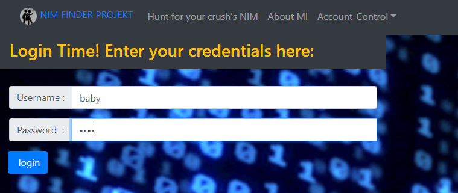
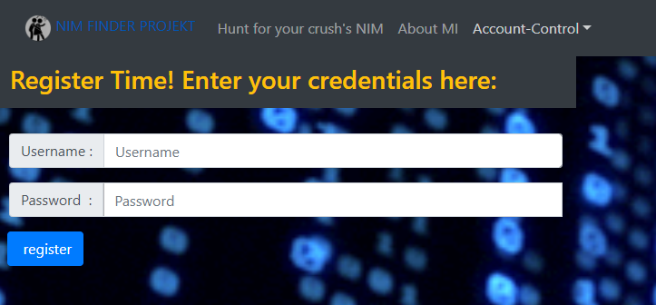
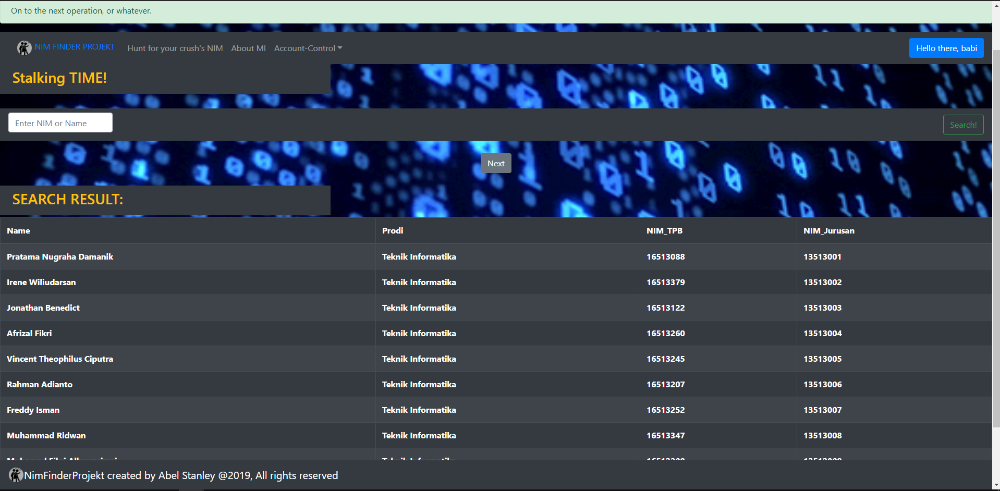

# NimFinderProjekt
A simple one-page NIM finder web-app for ITB students
Created by Abel Stanley / 13517068

## HOW TO RUN:
### Install all dependencies:
1. Install React:
    npm install react

2. Install react bootstrap 4:
    npm install react-bootstrap bootstrap

3. Install react-loading-overlay module:
    npm i react-loading-overlay

4. Install react-browser-detection module:
    npm i react-browser-detection

### Run the project:
npm start

### Deploy to Github Page:
npm run build

## HOW TO USE:
1. View the homepage and enjoy the scenery:

2. Look at the 'Getting Started' guide to get you acquainted with the website:

3. View the minimalistic about me page, just in case you don't have anything better to do:

4. Then you get to do some login action:

5. If the account is not recognized, you will see this:

6. If successful:

7. If you don't have any account, register first:

8. Now do the searchie-searchie, with NIM:

9. Go to next page with searchie-searchie:

10. Searchie with Name:

## APPLICATION DESIGN:

This application adopts decorator pattern to display the pages. Index.js will call App.js to render the one-page web application. In App.js, there is a pageRenderLogic to determine which component (which represent a page) to render. App.js will render only one component at a time.

This application also implements chain-of-responsibility pattern as App.js gives the children components privilege to render itself.

This application also uses builder pattern to construct the RequestController. This is advantageous as RequestController is used across all components, such as Login, Register, and Search which all needs to make a request to the API. Why is this so? The builder pattern removes the biggest hurdle on creating the controller which needs differing parameters for each of them. With builder pattern, we don't have to make multiple constructors to meet every demands of the components. We just need to make a builder class which will handle what kind of parameters are needed. Thus in doing so, reduces the redundancy and physical coding burden.

A brief layout of project's components:
Super-Parent : App.js
Super-Parent calls body components to render, such as: About.js, BaseHomeModel, LoginModel, RegisterModel, SearchModel
Super-Parent also renders both footer and header everytime, such as: BaseFooterModel and BaseHeaderModel

Parent: BaseHomeModel
Provides interfaces to call App.js currentPage setter to change component to render.

Parent: LoginModel and RegisterModel
Both have child that is UserDataModel.

Child: UserDataModel
Calls ControllerBuilder to create RequestController and make Login or Register request to the API. Also calls state setter method inherited from App.js to modify   Super-Parent's state(child-grandparent interaction).

Parent: SearchModel
renders a child that is searchBarModel.

Child: searchBarModel
Calls ControllerBuilder to create RequestController and make search request to the API. Search by ID or NIM is recognized by performing isNaN check to searchString in getRequest Controller. Also calls state setter method inherited from App.js to modify   Super-Parent's state(child-grandparent interaction).

Child: AccountModal
A class that renders notifications.

Child: SearchResultModal
A class that renders getRequest result to the page. Uses a Model provided by UserDataModel.

Controllers: RequestController & RefreshController.
Request Controller manages sending various requests to the API and storing the response to Super-Parent's state.
Refresh Controller plays part in determining whether the page is loading or not (waiting for API call).

##Library:
1. [react.js](https://www.npmjs.com/package/react)
2. [react-browser-detection](https://www.npmjs.com/package/react-browser-detection)
3. [react-loading-overlay](https://www.npmjs.com/package/react-loading-overlay)
4. [react-bootstrap](https://www.npmjs.com/package/react-bootstrap)

##Review:
Nice API. Easy to use and quick response. API's endpoints are clear and precise while providing the service expected of it. Would be nice though, if the API could also return entry count as a result of a search request. It would make pagination endeavor much easier.
